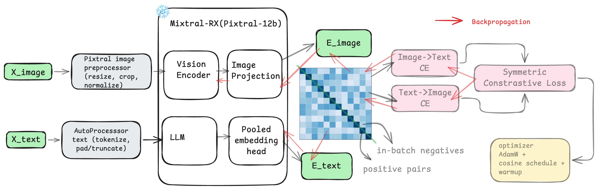
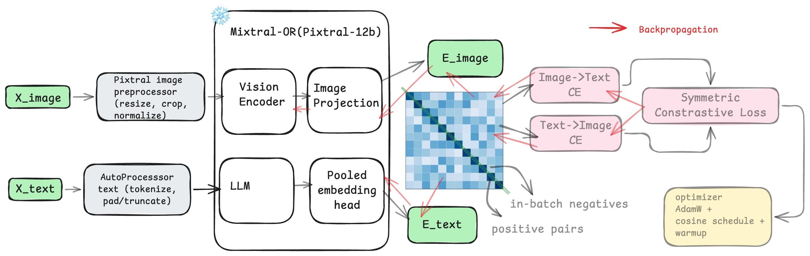
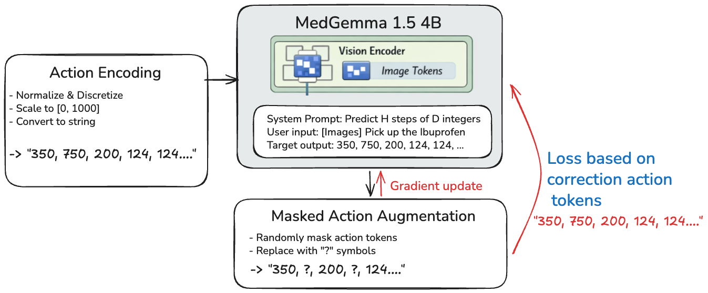
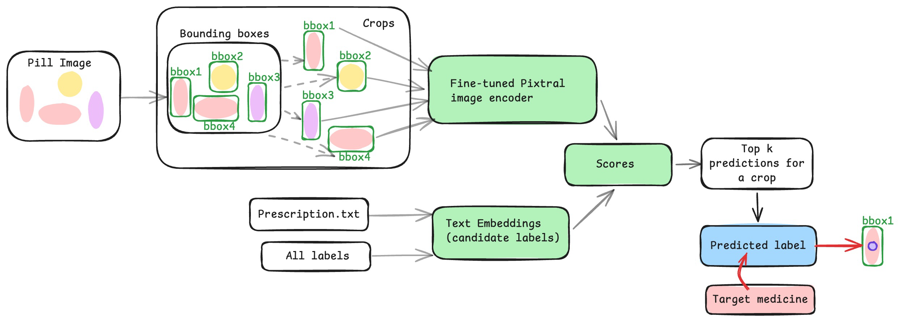
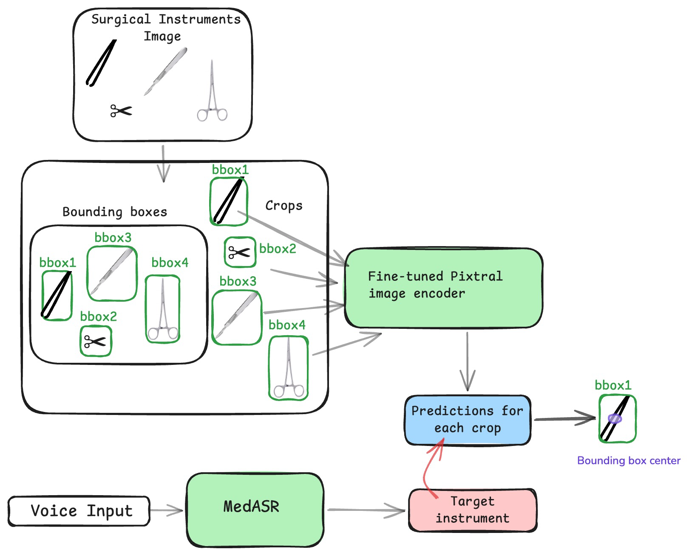

# MISTRIX Family of Models: Enabling MISTRAL to Interact with the Physical World

## Code Availability and Reproducibility

The training and inference code for each MISTRIX component is available in its dedicated subdirectory:

- [MISTRIX-Rx](MISTRIX-Rx/)
- [MISTRIX-OR](MISTRIX-OR/)
- [MISTRIX-Act](MISTRIX-Act/)

All core pipelines are organized so they can be run and reproduced even if you do **not** have a robot. We designed the repository to make results reproducible from software-only workflows and provided assets, scripts, and module-level run instructions in each component folder.

For **physical execution** with MISTRIX-Act, you should use the **SO-100 Arm**.

## Team
- Navya Gupta: Data Scientist at Kalderos 
  - Speciality: Multimodal Machine Learning, LLM distillation, Edge ML, product 
  - Technical Contributions: Product ideation, Development of MISTRIX Rx, MISTRIX OR 
- Gokul Puthumanaillam: PhD Candidate at UIUC 
  - Speciality: Robotics 
  - Technical Contributions: Development of MISTRIX Act, connection of MISTRIX components

## Problem Statement

Healthcare teams are under sustained staffing pressure, especially in perioperative care. Nursing shortages and burnout create a predictable failure mode where less time is available for direct patient care.This is not just a workforce issue; it is a workflow reliability issue. In surgery and aftercare, staffing strain contributes to delays, higher cognitive load, and increased risk of avoidable errors. The practical consequence is a worse experience for the people who matter most:
- Nurses face repeated interruptions and task-switching during medication routines.
- Surgeons / OR teams lose time to instrument friction and handoff delays. 
- Patients experience downstream effects from overloaded systems (slower transitions, less attention, more variability, canceled procedures due to short-staffing)(7).  

## Overall Solution
MISTRIX is implemented as a coordinated family of models that share a common design principle: clinical assistance should be modular, auditable, and operationally useful. The family consists of MISTRIX Rx for medication-centric visual reasoning, MISTRIX OR for surgical tool perception under closed-label constraints, and MISTRIX Act for embodied, real-time physical execution. Together, these modules support end-to-end task completion where language instructions, scene understanding, candidate selection, robot control, and clinician approval can be composed into one coherent pipeline.

## MISTRIX Rx (Technical Details)

MISTRIX Rx is built on a Pixtral 12B vision-language architecture fine-tuned for pill identification and constrained candidate selection. The training setup links medication imagery and label text through supervised instruction-style examples so the model learns to produce clinically useful medicine-name outputs from visual input under controlled prompts.

The inference strategy is prompt-constrained generation with ranking against prescription-aware candidate sets. This keeps outputs auditable while reducing irrelevant labels at decision time. The result is a practical medication-perception module that preserves multimodal reasoning while producing structured outputs that integrate cleanly with downstream clinical workflow checks.

## MISTRIX OR (Technical Details)

MISTRIX OR uses a Pixtral 12B-based visual pipeline tuned for surgical instrument identification under constrained candidate sets. The OR task behaves as a mostly closed-label setting, so the pipeline is optimized for stable class discrimination, low-latency decisions, and reproducible outputs at runtime.

The architecture is intentionally pragmatic: constrain generation/ranking behavior, keep decision traces inspectable, and align model outputs to the instrument vocabulary used by workflow logic. This supports operational robustness and easier monitoring of class confusion or confidence failures in deployment.

## MISTRIX Act (Technical Details)

MISTRIX Act is the embodiment layer and is tuned around a Pixtral 12B-centered multimodal policy stack for real-time physical task execution. Its training objective is not image classification or static captioning; it is control-conditioned behavior generation from multimodal context. The model consumes scene observations and task intent, then predicts control-relevant action outputs that can be executed at high frequency in robot control loops. This makes MISTRIX Act fundamentally different from pure VLM inference modules: it is optimized for temporal consistency and executable behavior under sequential constraints.

The training data recipe incorporates demonstrations with varying fidelity levels so that the policy can learn both stable primitives and realistic execution variability. That diversity is important for robustness because deployment conditions are never identical to curated data captures. MISTRIX Act is therefore framed as a policy component in a supervised assistance loop rather than an unconstrained autonomous agent. In integrated workflows, it executes repetitive physical subtasks, reports execution state, and hands back control points where clinician authorization is required. This preserves safety and traceability while still returning meaningful clinical capacity.

## Showcasing Workflow 1: Autonomous Medicine Administration

Demo output: [Demo 1](assets/demo1.mp4)

The first workflow composes MISTRIX Rx and MISTRIX Act around a medication-administration scenario with approval control. A prescription is ingested and converted into structured task context. MISTRIX Act executes the physical acquisition steps needed to capture relevant cabinet imagery. MISTRIX Rx then performs segmentation-aware medication labeling and candidate resolution in an aligned image-text space, with output constrained by clinically valid context. The pipeline then returns a supervised decision point where a clinician can approve or reject execution before physical delivery completes. This design preserves authority while removing repetitive mechanical burden from nursing time.

## Showcasing Workflow 2: Autonomous Surgery Helper

Demo output: [Demo 2](assets/Demo2.mp4)

The second workflow combines MISTRIX OR, MISTRIX Act, and MedASR in an operating-room support pattern. Voice instructions are converted into structured command intent, MISTRIX OR resolves instrument class context from visual input, and MISTRIX Act executes control steps for the requested assistive action. The workflow is structured to mimic natural clinician communication rather than requiring artificial command protocols. Technically, this demonstrates an integrated perception-language-action loop that can run in real time while remaining interpretable at each module boundary.

## Impact This Project Can Bring
MISTRIX has the potential to drive outsized impact at a cost potentially as low as $300 per robot. That price point matters because it changes deployment from a small pilot luxury into something that can be rolled out in multiple hospital workflows where staffing pressure is acute. In surgical settings, where each minute carries real operational value, even modest delay reduction can create meaningful gains in schedule stability, throughput, and room utilization without requiring additional full-time hires.

Beyond direct payroll savings for care teams, MISTRIX's bigger value is returning clinical capacity to them while working in tandem, improving workflow reliability, and reducing delays and cancellations for patients. The system is designed to remove repetitive, time-critical support tasks from nurses and perioperative teams so they can reallocate effort toward assessment, patient education, escalation, and other judgment-heavy care activities that are hard to automate and central to outcomes.

At the operations layer, the strongest impact is reliability. When routine support tasks are executed faster and more consistently, daily schedules become more predictable, handoffs become smoother, and cascading delays are less likely to propagate across the unit. That reliability translates into fewer last-minute disruptions, reduced overtime pressure, and lower cancellation risk, which improves both clinician working conditions and patient experience.

At the safety and outcomes layer, MISTRIX supports standardized execution, traceable logs, and rapid exception escalation, which directly address known failure amplifiers such as fatigue, interruptions, and staffing shortages. We are not claiming that a robot alone causes downstream outcome improvements; the claim is that reducing avoidable burden on care teams creates a plausible and evidence-aligned pathway to safer medication processes and better post-procedure recovery support under real-world hospital constraints.

[1] C. P. Childers and M. Maggard-Gibbons, “Understanding Costs of Care in the Operating Room,” *JAMA Surgery*, vol. 153, no. 4, Art. no. e176233, 2018, doi: 10.1001/jamasurg.2017.6233.

[2] World Health Organization, “Nursing and midwifery,” *Fact sheet*, Jul. 17, 2025. [Online]. Available: [https://www.who.int/news-room/fact-sheets/detail/nursing-and-midwifery](https://www.who.int/news-room/fact-sheets/detail/nursing-and-midwifery). [Accessed: Feb. 24, 2026]. ([World Health Organization][1])

[3] P. Meredith, L. Turner, C. Saville, and P. Griffiths, “Nurse understaffing associated with adverse outcomes for surgical admissions,” *British Journal of Surgery*, vol. 111, no. 9, Art. no. znae215, Sep. 2024, doi: 10.1093/bjs/znae215. ([OUP Academic][2])

[4] World Health Organization, “Medication Without Harm,” *Initiative*. [Online]. Available: [https://www.who.int/initiatives/medication-without-harm](https://www.who.int/initiatives/medication-without-harm). [Accessed: Feb. 24, 2026]. ([World Health Organization][3])

[5] National Academy of Medicine, “CLINICIAN BURNOUT: A Crisis in Health Care,” infographic, 2020. [Online]. Available: [https://nam.edu/wp-content/uploads/2020/08/Clinician-Burnout-Infographic_FINAL_print.pdf](https://nam.edu/wp-content/uploads/2020/08/Clinician-Burnout-Infographic_FINAL_print.pdf). [Accessed: Feb. 24, 2026]. ([NAM][4])

[6] American College of Physicians, “ACP Recommends AI Tech Should Augment Physician Decision-Making, Not Replace It,” *ACP Newsroom*, Jun. 4, 2024. [Online]. Available: [https://www.acponline.org/acp-newsroom/acp-recommends-ai-tech-should-augment-physician-decision-making-not-replace-it](https://www.acponline.org/acp-newsroom/acp-recommends-ai-tech-should-augment-physician-decision-making-not-replace-it). [Accessed: Feb. 24, 2026]. ([American College of Physicians][5])

[7] J. I. Westbrook, A. Woods, M. I. Rob, W. T. Dunsmuir, and R. O. Day, “Association of interruptions with an increased risk and severity of medication administration errors,” *Archives of Internal Medicine*, vol. 170, no. 8, pp. 683–690, Apr. 2010, doi: 10.1001/archinternmed.2010.65.

[1]: https://www.who.int/news-room/fact-sheets/detail/nursing-and-midwifery?utm_source=chatgpt.com "Nursing and midwifery"
[2]: https://academic.oup.com/bjs/article/111/9/znae215/7763108?utm_source=chatgpt.com "Nurse understaffing associated with adverse outcomes for ..."
[3]: https://www.who.int/initiatives/medication-without-harm?utm_source=chatgpt.com "Medication Without Harm"
[4]: https://nam.edu/wp-content/uploads/2020/08/Clinician-Burnout-Infographic_FINAL_print.pdf?utm_source=chatgpt.com "CLINICIAN BURNOUT: A Crisis in Health Care"
[5]: https://www.acponline.org/acp-newsroom/acp-recommends-ai-tech-should-augment-physician-decision-making-not-replace-it?utm_source=chatgpt.com "ACP Recommends AI Tech Should Augment Physician ..."
